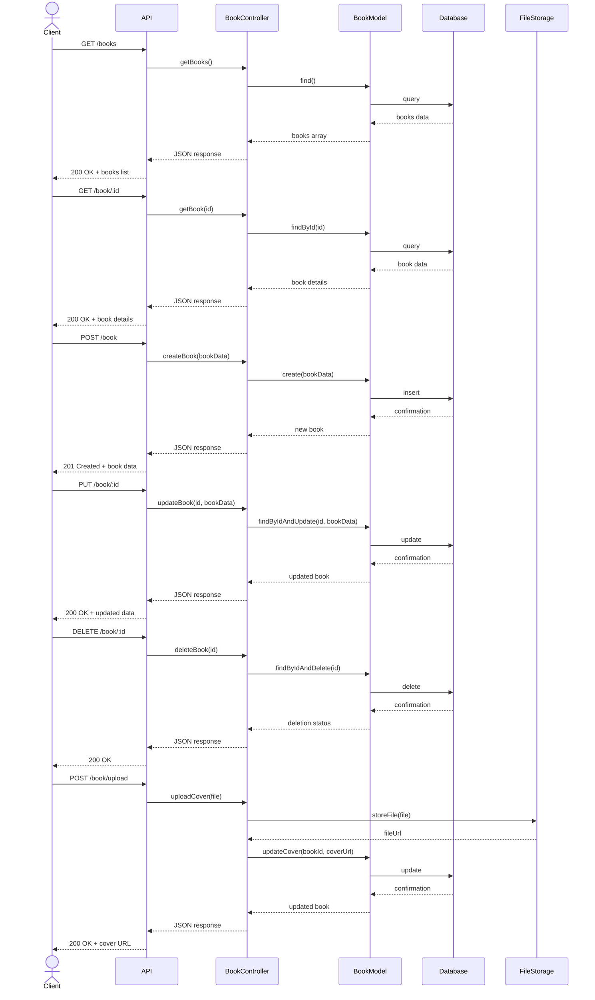
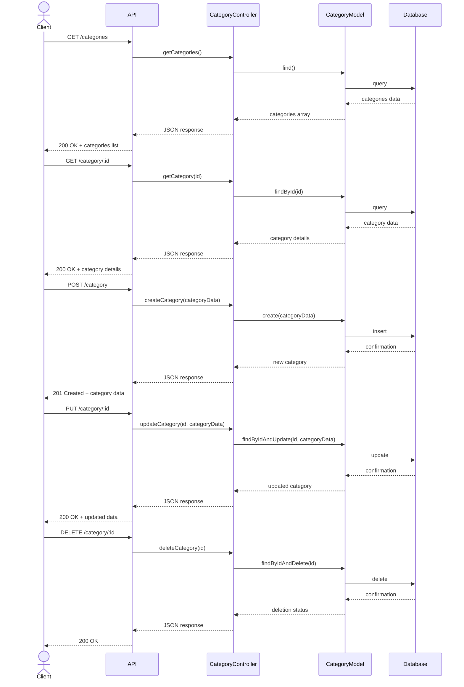
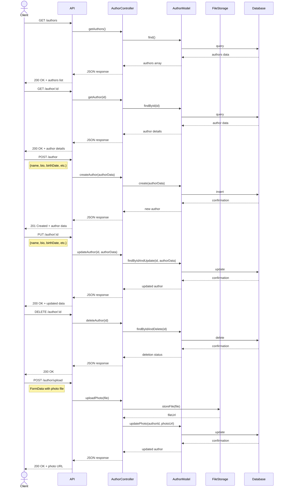
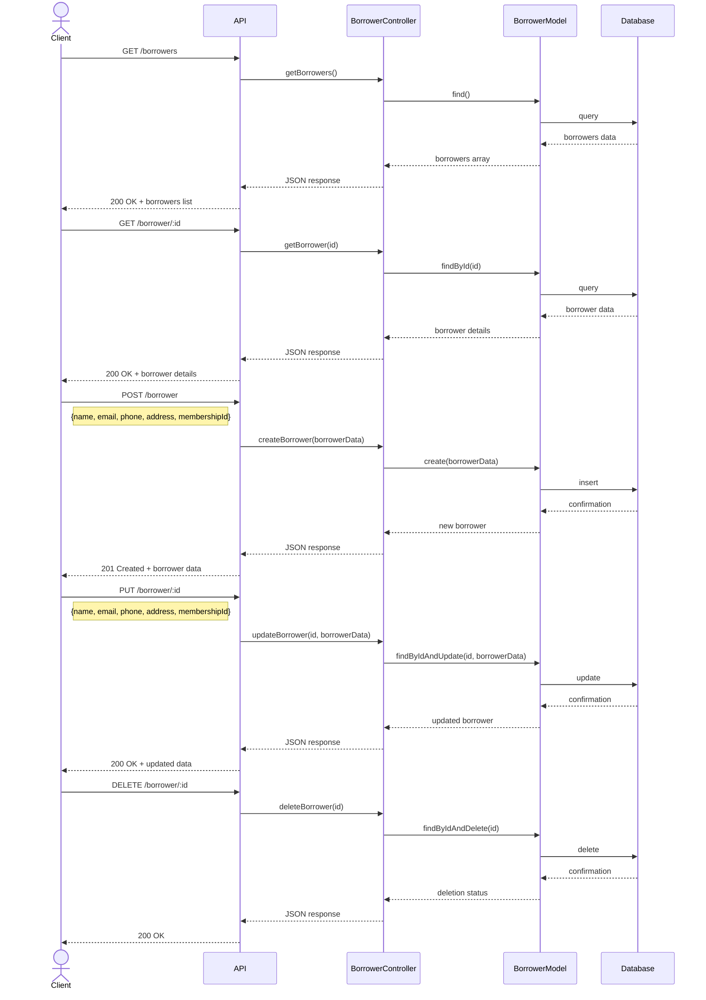
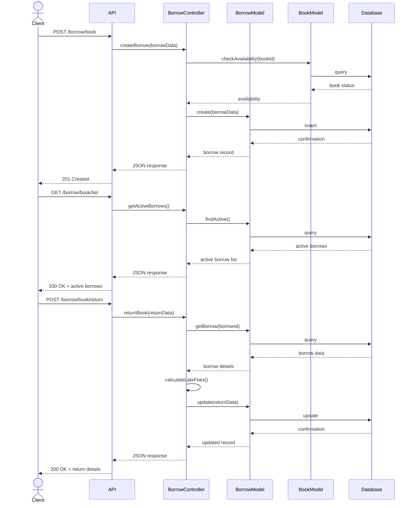
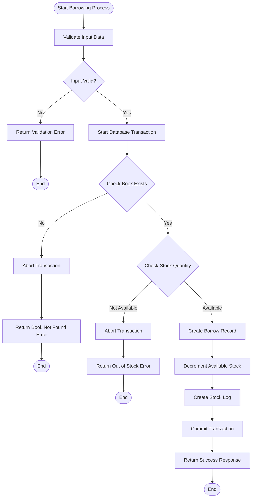
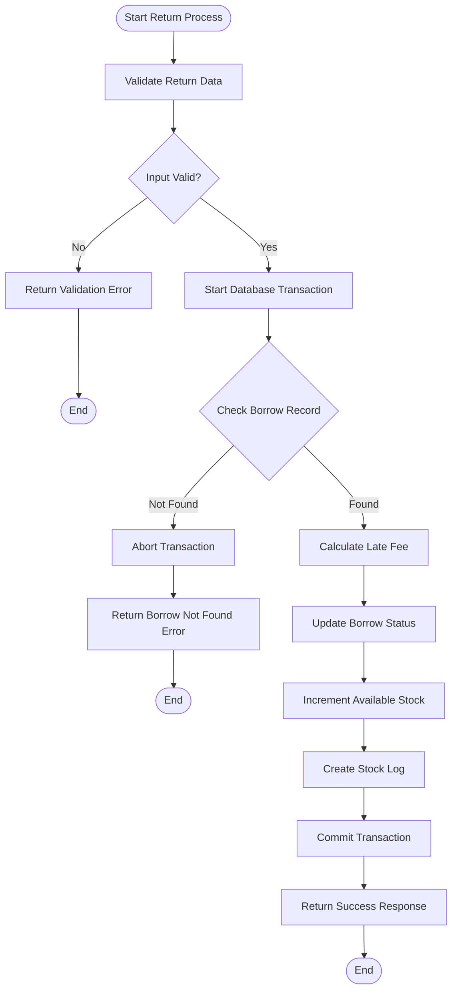
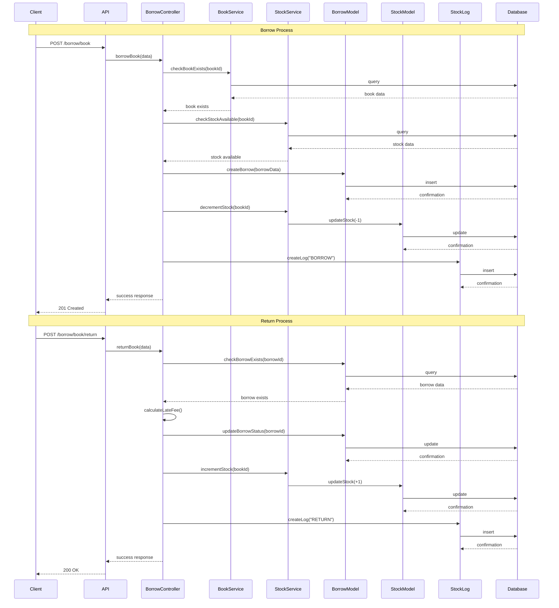
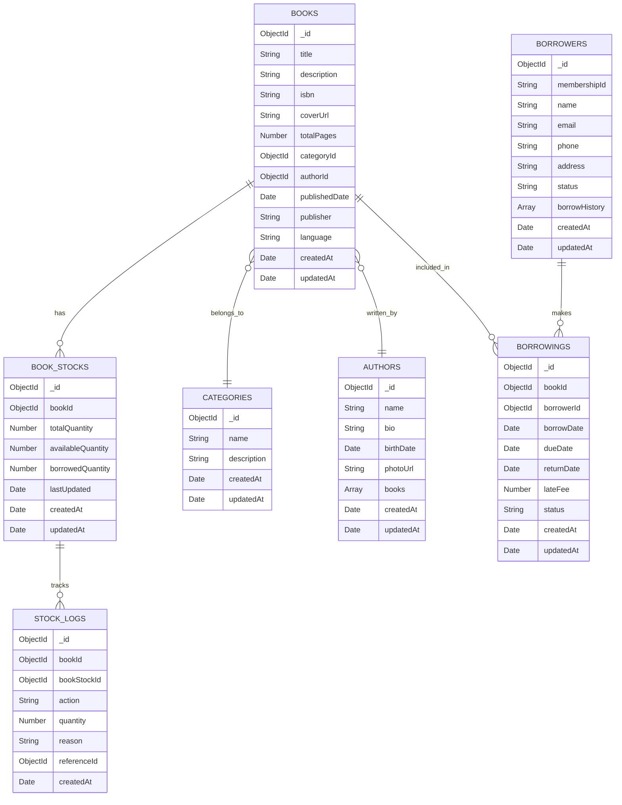

# Mulyono's Library System Design

- Changelog:
	- Initial Document - @indrafrds on 31 Oct 2024

You can render UML diagrams using [Mermaid](https://mermaid.live/edit).

## Usecase Diagram

```mermaid
stateDiagram
    state "Library Management System" as LMS {
        state "Book Management" as BM {
            [*] --> ViewBooksList
            [*] --> ViewBookDetail
            [*] --> AddNewBook
            [*] --> UpdateBook
            [*] --> DeleteBook
            [*] --> UploadBookCover
        }
        
        state "Author Management" as AM {
            [*] --> ViewAuthorsList
            [*] --> ViewAuthorDetail
            [*] --> AddNewAuthor
            [*] --> UpdateAuthor
            [*] --> DeleteAuthor
            [*] --> UploadAuthorPhoto
        }
        
        state "Category Management" as CM {
            [*] --> ViewCategoriesList
            [*] --> ViewCategoryDetail
            [*] --> AddNewCategory
            [*] --> UpdateCategory
            [*] --> DeleteCategory
        }
        
        state "Borrower Management" as BRM {
            [*] --> ViewBorrowersList
            [*] --> ViewBorrowerDetail
            [*] --> AddNewBorrower
            [*] --> UpdateBorrower
            [*] --> DeleteBorrower
        }
        
        state "Book Borrowing" as BB {
            [*] --> CreateBookBorrowing
            [*] --> ViewActiveBorrowings
            [*] --> ProcessBookReturn
            ProcessBookReturn --> CalculateFees
        }
    }
```



## Sequence Diagrams

### 1. Book Management


### 2. Category Management



### 3. Author Management



### 4. Borrower Management



### 5. Borrowing Management



## Detailed Logic for Borrowing and Returning

### 1. Borrowing Process Flowchart



### 2. Returning Process Flowchart



### 3. Sequence Diagram for Borrowing and Returning Process



## Entity Relationship Diagram and MongoDB Collection Schema

### 1. ER Diagram


### 2. MongoDB Collection Schema

#### Books Collection
```javascript
{
    _id: ObjectId,
    title: String,
    description: String,
    isbn: String,
    coverUrl: String,
    totalPages: Number,
    categoryId: ObjectId,  // Reference to CATEGORIES
    authorId: ObjectId,    // Reference to AUTHORS
    publishedDate: Date,
    publisher: String,
    language: String,
    createdAt: Date,
    updatedAt: Date
}
```

#### Authors Collection
```javascript
{
    _id: ObjectId,
    name: String,
    bio: String,
    birthDate: Date,
    photoUrl: String,
    books: [ObjectId],     // Array of book references
    createdAt: Date,
    updatedAt: Date
}
```

#### Categories Collection
```javascript
{
    _id: ObjectId,
    name: String,
    description: String,
    createdAt: Date,
    updatedAt: Date
}
```

#### Borrowers Collection
```javascript
{
    _id: ObjectId,
    membershipId: String,
    name: String,
    email: String,
    phone: String,
    address: String,
    status: String,        // Active/Inactive
    borrowHistory: [ObjectId], // Array of borrowing references
    createdAt: Date,
    updatedAt: Date
}
```

#### Borrowings Collection
```javascript
{
    _id: ObjectId,
    bookId: ObjectId,      // Reference to BOOKS
    borrowerId: ObjectId,  // Reference to BORROWERS
    borrowDate: Date,
    dueDate: Date,
    returnDate: Date,
    lateFee: Number,
    status: String,        // Active/Returned/Overdue
    createdAt: Date,
    updatedAt: Date
}
```

#### Book Stocks Collection
```javascript
{
    _id: ObjectId,
    bookId: ObjectId,      // Reference to BOOKS
    totalQuantity: Number,
    availableQuantity: Number,
    borrowedQuantity: Number,
    lastUpdated: Date,
    createdAt: Date,
    updatedAt: Date
}
```

#### Stock Logs Collection
```javascript
{
    _id: ObjectId,
    bookId: ObjectId,      // Reference to BOOKS
    bookStockId: ObjectId, // Reference to BOOK_STOCKS
    action: String,        // Add/Remove/Borrow/Return
    quantity: Number,
    reason: String,
    referenceId: ObjectId, // Could reference BORROWINGS or other documents
    createdAt: Date
}
```

## Relationships

1.  Books → Categories: Many-to-One
2.  Books → Authors: Many-to-One
3.  Books → Book Stocks: One-to-One
4.  Books → Borrowings: One-to-Many
5.  Borrowers → Borrowings: One-to-Many
6.  Book Stocks → Stock Logs: One-to-Many